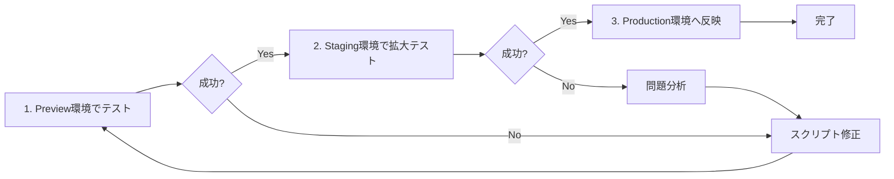

# 📊 データ収集戦略ガイド

## 🌍 環境別の役割と進め方

### 1. **Preview環境（テスト）**
- **URL**: https://deploy-preview-*--oshikatsu-collection.netlify.app
- **データベース**: Staging DB（oshikatsu-development）
- **用途**: 
  - 新しい収集スクリプトのテスト
  - 少量データ（1-5件）での動作確認
  - エラー検証

### 2. **Staging環境（検証）**
- **URL**: https://develop--oshikatsu-collection.netlify.app
- **データベース**: Staging DB（oshikatsu-development）
- **用途**:
  - 中規模データ収集（50-100件）
  - パフォーマンステスト
  - UI/UX確認

### 3. **Production環境（本番）**
- **URL**: https://collection.oshikatsu-guide.com
- **データベース**: Production DB
- **用途**:
  - 検証済みデータの本番反映
  - ユーザー向けサービス提供

## 🔄 推奨ワークフロー



## 📋 段階的実行プラン

### **Phase 1: Preview環境でテスト（今日）**
```bash
# 環境変数をstaging用に設定
export VITE_ENVIRONMENT=preview
export VITE_SUPABASE_URL=https://ptlwzxwjchcmwzajfqex.supabase.co
export VITE_SUPABASE_ANON_KEY=staging_key

# 少量データ収集（1-5件）
npm run collect:yoni-basic    # 基本情報のみ
npm run collect:yoni-videos -- --limit=5  # 動画5件のみ
```

### **Phase 2: Staging環境で検証（明日）**
```bash
# 環境変数はPhase 1と同じ（同じDB使用）
export VITE_ENVIRONMENT=staging

# 中規模データ収集（50-100件）
npm run collect:yoni-popular  # 人気動画50件
npm run collect:yoni-videos -- --limit=100  # 動画100件
```

### **Phase 3: Production環境へ反映（検証後）**
```bash
# 環境変数を本番用に設定
export VITE_ENVIRONMENT=production
export VITE_SUPABASE_URL=https://awaarykghpylggygkiyp.supabase.co
export VITE_SUPABASE_ANON_KEY=production_key

# 検証済みスクリプトで全データ収集
npm run collect:yoni-all  # 全データ収集
```

## ⚠️ 注意事項

### API制限管理
- YouTube API: 1日10,000ユニット
- 1動画取得: 約3ユニット
- 1日最大: 約3,000動画まで

### データ整合性
- Staging → Production移行時の重複チェック
- IDの一意性確保
- タイムスタンプの管理

### ロールバック計画
- 各段階でバックアップ作成
- 問題発生時の切り戻し手順準備
- エラーログの保存

## 🔐 環境変数の切り替え

### 方法1: 一時的な環境変数設定
```bash
# Preview/Staging用
VITE_ENVIRONMENT=staging VITE_SUPABASE_URL=xxx npm run collect:yoni-basic

# Production用
VITE_ENVIRONMENT=production npm run collect:yoni-basic
```

### 方法2: 環境別設定ファイル
```bash
# .env.staging を作成して使用
cp .env.production .env.staging
# エディタで.env.stagingのURLとキーを変更

# スクリプト実行時に指定
npm run collect:yoni-basic -- --env=staging
```

## 📊 成功基準

### Preview環境
- [ ] エラーなく実行完了
- [ ] データが正しくDBに保存
- [ ] UI上で表示確認

### Staging環境
- [ ] 50件以上のデータ収集成功
- [ ] パフォーマンス問題なし
- [ ] ユーザー要望機能の動作確認

### Production環境
- [ ] 全データ収集完了
- [ ] 既存データとの整合性
- [ ] ユーザーアクセス可能

## 🚀 実行コマンド例

### 今すぐPreview環境でテスト
```bash
# 1. staging DBの接続情報を設定
export VITE_SUPABASE_URL=https://ptlwzxwjchcmwzajfqex.supabase.co
export VITE_SUPABASE_ANON_KEY=[staging_anon_key]

# 2. 基本データ収集（1件のみ）
npm run collect:yoni-basic

# 3. 結果確認
open https://develop--oshikatsu-collection.netlify.app
```