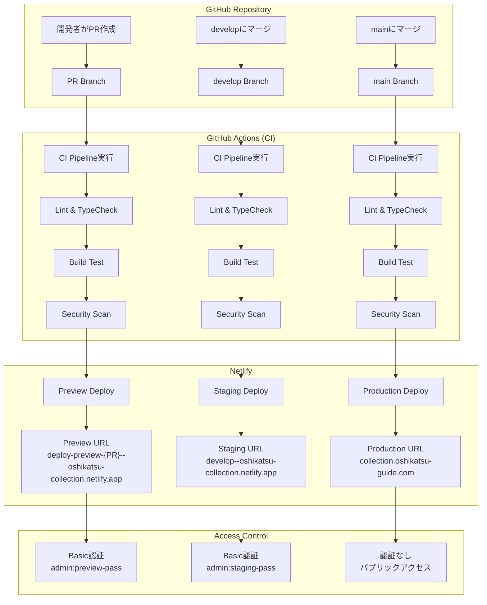

# 🚀 デプロイメントガイド

GitHub→Netlifyの自動デプロイフローと手順について説明します。

## 📊 デプロイフロー図



## 🔄 ブランチ戦略

### ブランチ構成

```
main (本番)
├── develop (ステージング)
    ├── feature/user-auth (機能ブランチ)
    ├── feature/data-collection (機能ブランチ)
    └── bugfix/admin-panel (バグ修正ブランチ)
```

### ブランチごとの役割

| ブランチ | 用途 | デプロイ先 | マージ先 |
|---------|------|-----------|----------|
| `main` | 本番リリース | Production | - |
| `develop` | 統合・検証 | Staging | `main` |
| `feature/*` | 新機能開発 | Preview (PR) | `develop` |
| `bugfix/*` | バグ修正 | Preview (PR) | `develop` |
| `hotfix/*` | 緊急修正 | Preview (PR) | `main` & `develop` |

## 🛠️ デプロイ手順

### 1. 機能開発からリリースまで

#### Step 1: 機能ブランチ作成
```bash
# developから最新を取得
git checkout develop
git pull origin develop

# 機能ブランチ作成
git checkout -b feature/new-feature

# 開発作業...
git add .
git commit -m "feat: 新機能を追加"
git push origin feature/new-feature
```

#### Step 2: PR作成
```bash
# GitHub上でPRを作成
# - Base: develop
# - Compare: feature/new-feature
# - Preview環境が自動で作成される
```

#### Step 3: レビュー・テスト
- Preview環境でテスト: `https://deploy-preview-{PR番号}--oshikatsu-collection.netlify.app`
- Basic認証: `admin:preview-password`
- CI/CDが自動実行される

#### Step 4: developへマージ
```bash
# PRを approve → merge
# - Staging環境に自動デプロイ
# - https://develop--oshikatsu-collection.netlify.app で確認
```

#### Step 5: 本番リリース
```bash
# develop → main のPRを作成
# 最終確認後、mainへマージ
# - Production環境に自動デプロイ
# - https://collection.oshikatsu-guide.com で確認
```

### 2. 緊急修正（Hotfix）

```bash
# mainから緊急修正ブランチ作成
git checkout main
git pull origin main
git checkout -b hotfix/critical-bug

# 修正作業...
git add .
git commit -m "fix: 緊急修正"
git push origin hotfix/critical-bug

# main と develop 両方にPR作成
# 1. hotfix/critical-bug → main
# 2. hotfix/critical-bug → develop
```

## ⚙️ Netlify設定

### サイト設定

```toml
# netlify.toml
[build]
  command = "npm run build"
  publish = "dist"
  environment = { NODE_VERSION = "18" }

# 環境別設定
[context.production]
  environment = { APP_ENV = "production" }

[context."develop"]
  environment = { APP_ENV = "staging" }

[context.deploy-preview]
  environment = { APP_ENV = "preview" }
```

### 環境変数設定

#### Netlify Dashboard → Site Settings → Environment Variables

**Production環境:**
```bash
APP_ENV=production
VITE_ENVIRONMENT=production
VITE_APP_URL=https://collection.oshikatsu-guide.com
VITE_SUPABASE_URL=https://prod-project.supabase.co
VITE_SUPABASE_ANON_KEY=prod_anon_key
VITE_YOUTUBE_API_KEY=your_youtube_api_key
```

**Branch Deploys (Staging):**
```bash
APP_ENV=staging
VITE_ENVIRONMENT=staging
BASIC_AUTH=admin:staging_password
VITE_SUPABASE_URL=https://staging-project.supabase.co
VITE_SUPABASE_ANON_KEY=staging_anon_key
```

**Deploy Previews:**
```bash
APP_ENV=preview
VITE_ENVIRONMENT=preview
BASIC_AUTH=admin:preview_password
# 他はstagingと同じ
```

## 🔍 GitHub Actions CI/CD

### ワークフロー概要

```yaml
# .github/workflows/ci.yml
name: CI/CD Pipeline

on:
  pull_request:
    branches: [ main, develop ]
  push:
    branches: [ main, develop ]
```

### 実行ジョブ

1. **Lint & Type Check**: コード品質チェック
2. **Build Test**: 各環境でのビルドテスト
3. **Security Scan**: セキュリティ脆弱性チェック
4. **Deployment Info**: デプロイ情報の表示

### ワークフロー実行タイミング

| アクション | トリガー | 実行内容 |
|-----------|----------|----------|
| PR作成・更新 | `pull_request` | 全チェック実行 |
| develop push | `push: develop` | 全チェック + Staging情報 |
| main push | `push: main` | 全チェック + Production情報 |

## 🚨 トラブルシューティング

### よくある問題と対処法

#### 1. ビルドエラー

```bash
# エラー例
npm ERR! missing script: typecheck

# 対処法
npm install -D typescript
```

#### 2. 環境変数が反映されない

- Netlify Dashboard で設定を確認
- ビルドログで環境変数の値をチェック
- `APP_ENV` vs `VITE_ENVIRONMENT` の使い分けを確認

#### 3. Basic認証が動かない

- `BASIC_AUTH` 形式確認: `username:password`
- Netlify Functions の動作確認
- 環境（staging/preview）の設定確認

#### 4. Supabase接続エラー

- 環境ごとのSupabaseプロジェクトを確認
- 本番キーをstaging/previewで使っていないか確認
- RLS（Row Level Security）設定を確認

## 📝 デプロイチェックリスト

### PR作成前
- [ ] ローカルでビルドテスト（`npm run build`）
- [ ] Lint・型チェック（`npm run lint`, `npm run typecheck`）
- [ ] `.env.example` に新しい環境変数を追加

### PR作成後
- [ ] GitHub Actions CI が成功
- [ ] Preview環境で動作確認
- [ ] Basic認証でアクセス可能

### Staging環境確認
- [ ] develop への マージ後、Staging環境で確認
- [ ] 統合テスト実施
- [ ] パフォーマンステスト

### Production リリース前
- [ ] Staging環境での最終確認
- [ ] データベースマイグレーション確認
- [ ] 環境変数の本番設定確認

### Production リリース後
- [ ] 本番環境での動作確認
- [ ] エラーログ監視
- [ ] パフォーマンス監視