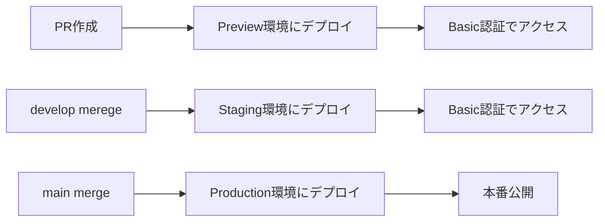

# 🌍 環境構成ガイド

oshikatsu-collectionでは、**Production（main）** + **Staging（develop）** + **PRごとのPreview** の3つの環境を運用しています。

## 📋 環境一覧

| 環境 | ブランチ | URL | 用途 | Basic認証 |
|------|---------|-----|------|-----------|
| **Production** | `main` | https://collection.oshikatsu-guide.com | 本番運用 | ❌ なし |
| **Staging** | `develop` | https://develop--oshikatsu-collection.netlify.app | 統合テスト・検証 | ✅ あり |
| **Preview** | PR branches | `https://deploy-preview-{PR番号}--oshikatsu-collection.netlify.app` | 機能テスト | ✅ あり |

## 🔧 環境変数マトリクス

### Netlifyでの環境変数設定

| 変数名 | Production (main) | Branch deploy (develop) | Deploy previews (PR) |
|--------|------------------|----------------------|---------------------|
| `APP_ENV` | `production` | `staging` | `preview` |
| `VITE_ENVIRONMENT` | `production` | `staging` | `preview` |
| `VITE_APP_URL` | `https://collection.oshikatsu-guide.com` | `https://develop--oshikatsu-collection.netlify.app` | 自動発行URL |
| `VITE_SUPABASE_URL` | 本番プロジェクト | ステージングプロジェクト | ステージング or 専用 |
| `VITE_SUPABASE_ANON_KEY` | 本番キー | ステージングキー | ステージング or 専用 |
| `BASIC_AUTH` | （空・設定なし） | `admin:staging-password` | `admin:preview-password` |

### 環境変数の設定場所

#### Netlifyダッシュボードでの設定

1. **Site settings** → **Environment variables** に移動
2. 各環境（Production / Branch deploys / Deploy previews）ごとに設定

```bash
# Production環境のみ
APP_ENV=production
VITE_APP_URL=https://collection.oshikatsu-guide.com
VITE_SUPABASE_URL=https://your-prod-project.supabase.co
VITE_SUPABASE_ANON_KEY=your-prod-anon-key

# Staging環境（develop branch）
APP_ENV=staging
VITE_APP_URL=https://develop--oshikatsu-collection.netlify.app
VITE_SUPABASE_URL=https://your-staging-project.supabase.co
VITE_SUPABASE_ANON_KEY=your-staging-anon-key
BASIC_AUTH=admin:your-staging-password

# Preview環境（PR）
APP_ENV=preview
BASIC_AUTH=admin:your-preview-password
# その他はstagingと同じ値を使用
```

## 🗄️ データベース構成

### Supabaseプロジェクトの分離

| 環境 | Supabase プロジェクト | データ |
|------|---------------------|--------|
| **Production** | `your-prod-project` | 本番データ（よにのちゃんねるの実データ） |
| **Staging** | `your-staging-project` | テスト用データ（本番のコピー or サンプル） |
| **Preview** | Staging共用 or 専用 | テスト用データ |

### 重要な注意点

- ⚠️ **本番のSupabaseキーをstaging/previewで絶対に使わない**
- ✅ staging用のSupabaseプロジェクトを別途作成する
- ✅ 本番データを staging/preview で誤って変更しないよう注意

## 🔒 セキュリティ設定

### Basic認証

- **Staging/Preview環境のみ**適用
- Netlify Functionsで実装（`netlify/functions/auth.js`）
- 認証情報：`BASIC_AUTH` 環境変数（`username:password` 形式）

### robots.txt

- **Production**: SEOフレンドリーな設定
- **Staging/Preview**: `Disallow: /` でインデックス防止
- Netlify Functionsで動的生成（`netlify/functions/robots.js`）

## 🚀 デプロイフロー

### 自動デプロイ



### デプロイタイミング

- **Preview**: PR作成・更新時に自動
- **Staging**: developブランチへのpush時に自動
- **Production**: mainブランチへのpush時に自動

## 🎯 環境別の使い方

### Production環境

- ✅ 本番運用
- ✅ SEO対象
- ✅ アナリティクス収集
- ❌ Basic認証なし

### Staging環境

- ✅ 統合テスト
- ✅ クライアントレビュー
- ✅ パフォーマンステスト
- ✅ Basic認証でアクセス制限

### Preview環境

- ✅ PR単位での機能テスト
- ✅ デザインレビュー
- ✅ バグ修正の確認
- ✅ Basic認証でアクセス制限

## 🔧 環境切り替え

### ローカル開発での環境切り替え

```bash
# .env.development (ローカル)
APP_ENV=development
VITE_ENVIRONMENT=development
VITE_APP_URL=http://localhost:3000

# ローカルでstagingのデータを使いたい場合
VITE_SUPABASE_URL=https://your-staging-project.supabase.co
VITE_SUPABASE_ANON_KEY=your-staging-anon-key
```

### 環境判定コード例

```typescript
// 環境判定ユーティリティ
const APP_ENV = import.meta.env.APP_ENV || import.meta.env.VITE_ENVIRONMENT || 'development'

export const isProduction = APP_ENV === 'production'
export const isStaging = APP_ENV === 'staging'
export const isPreview = APP_ENV === 'preview'
export const isDevelopment = APP_ENV === 'development'

// Basic認証が有効かどうか
export const hasBasicAuth = isStaging || isPreview
```