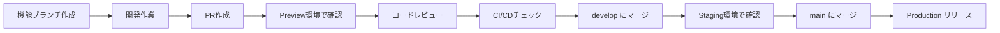

# 🚀 新規メンバー向けオンボーディング

oshikatsu-collectionプロジェクトへようこそ！このガイドに従って開発環境をセットアップしましょう。

## 📋 事前準備

### 必要なツール

- [ ] **Node.js 18+** - [公式サイト](https://nodejs.org/)からインストール
- [ ] **Git** - バージョン管理
- [ ] **VS Code** （推奨） - エディタ
- [ ] **npm** - パッケージマネージャー（Node.jsに含まれる）

### アカウント準備

- [ ] **GitHub** - ソースコード管理
- [ ] **Netlify** - デプロイ・ホスティング  
- [ ] **Supabase** - データベース（管理者から招待）

## 🛠️ ローカル環境セットアップ

### 1. リポジトリのクローン

```bash
# HTTPSでクローン
git clone https://github.com/aratakobayashi/oshikatsu-collection.git

# または、SSHでクローン（推奨）
git clone git@github.com:aratakobayashi/oshikatsu-collection.git

# プロジェクトディレクトリに移動
cd oshikatsu-collection
```

### 2. 依存関係のインストール

```bash
# パッケージインストール
npm install

# インストール確認
npm --version
node --version
```

### 3. 環境変数の設定

```bash
# .env.example をコピーして .env.development を作成
cp .env.example .env.development

# .env.development を編集
# 管理者から提供される値を入力してください
```

#### 環境変数の設定例

```bash
# .env.development
APP_ENV=development
VITE_ENVIRONMENT=development
VITE_APP_URL=http://localhost:3000

# Supabase (管理者から提供)
VITE_SUPABASE_URL=https://staging-project.supabase.co
VITE_SUPABASE_ANON_KEY=your-staging-anon-key

# API Keys (管理者から提供)
VITE_YOUTUBE_API_KEY=your-youtube-api-key
VITE_GOOGLE_CUSTOM_SEARCH_API_KEY=your-google-api-key
VITE_GOOGLE_CUSTOM_SEARCH_ENGINE_ID=your-search-engine-id

# よにのチャンネル設定
VITE_YONI_CHANNEL_ID=UC2alHD2WkakOiTxCxF-uMAg
VITE_YONI_CHANNEL_URL=https://www.youtube.com/channel/UC2alHD2WkakOiTxCxF-uMAg
```

### 4. 開発サーバー起動

```bash
# 開発サーバー起動
npm run dev

# ブラウザで以下にアクセス
# http://localhost:3000
```

### 5. 動作確認

- [ ] ローカルでアプリが正常に起動する
- [ ] データベース接続が正常（セレブリティ一覧が表示される）
- [ ] 管理画面にアクセスできる（現在は認証無効化中）

## 🔄 開発フロー

### ブランチ運用ルール

```bash
# 1. 最新のdevelopブランチを取得
git checkout develop
git pull origin develop

# 2. 機能ブランチを作成
git checkout -b feature/your-feature-name

# 3. 開発・コミット
git add .
git commit -m "feat: 新機能を追加"

# 4. ブランチをプッシュ
git push origin feature/your-feature-name

# 5. GitHub上でPRを作成
# Base: develop ← Compare: feature/your-feature-name
```

### コミットメッセージルール

```bash
# 推奨フォーマット
feat: 新機能追加
fix: バグ修正  
docs: ドキュメント更新
style: コードスタイル修正
refactor: リファクタリング
test: テスト追加・修正
chore: ビルド・設定変更

# 例
feat: ユーザー認証機能を追加
fix: 管理画面のログインバグを修正
docs: APIドキュメントを更新
```

### PR作成 → マージまでの流れ



## 🌍 環境別アクセス方法

### Development（ローカル）
```bash
# 起動
npm run dev

# アクセス
http://localhost:3000
```

### Staging（develop ブランチ）
```bash
# URL
https://develop--oshikatsu-collection.netlify.app

# Basic認証
Username: admin
Password: staging-password (管理者に確認)
```

### Preview（PRごと）
```bash
# URL（PRを作成すると自動生成）
https://deploy-preview-{PR番号}--oshikatsu-collection.netlify.app

# Basic認証
Username: admin  
Password: preview-password (管理者に確認)
```

### Production（main ブランチ）
```bash
# URL
https://collection.oshikatsu-guide.com

# 認証：なし（パブリックアクセス）
```

## 🧪 テスト・品質チェック

### ローカルでの実行

```bash
# リント（コードスタイルチェック）
npm run lint

# 型チェック（TypeScript）
npm run typecheck  

# ビルドテスト
npm run build

# 全てのチェックを実行
npm run lint && npm run typecheck && npm run build
```

### CI/CDでの自動チェック

PR作成時に以下が自動実行されます：

- ✅ ESLint（コード品質）
- ✅ TypeScript型チェック  
- ✅ ビルドテスト（3環境）
- ✅ セキュリティスキャン

## 🗂️ プロジェクト構成

```
oshikatsu-collection/
├── src/
│   ├── components/     # React コンポーネント
│   ├── pages/         # ページコンポーネント
│   ├── lib/           # ユーティリティ・API
│   └── hooks/         # カスタムフック
├── docs/              # プロジェクトドキュメント
├── netlify/           # Netlify Functions
├── scripts/           # データ収集・管理スクリプト
├── .github/           # GitHub Actions
└── 設定ファイル各種
```

## 🎯 初回タスク（推奨）

### 1週間目
- [ ] 環境セットアップ完了
- [ ] ローカルでアプリ起動確認
- [ ] コードベース理解（主要コンポーネント）
- [ ] 簡単なバグ修正・改善のPRを1つ作成

### 2週間目  
- [ ] 機能追加のPRを1つ作成
- [ ] Preview環境での動作確認
- [ ] コードレビュープロセスの理解

### 1ヶ月目
- [ ] データベース構造の理解
- [ ] API連携部分の理解（YouTube、Wikipedia）
- [ ] 中規模の機能開発

## 🆘 困った時の連絡先

### 技術的な質問
- **Slack**: #oshikatsu-development
- **GitHub Issues**: バグ報告・機能提案

### 緊急時
- **管理者**: [連絡先を記載]

### よくある問題

#### 1. npm install でエラー

```bash
# Node.js バージョン確認
node --version  # 18+ 必要

# キャッシュクリア
npm cache clean --force
rm -rf node_modules package-lock.json
npm install
```

#### 2. 環境変数が効かない

```bash
# ファイル名確認
ls -la .env*

# .env.development が存在するか確認
# ブラウザを再起動（開発サーバー再起動）
```

#### 3. データベース接続エラー

```bash
# 環境変数の値を確認
echo $VITE_SUPABASE_URL
echo $VITE_SUPABASE_ANON_KEY

# 管理者にStagingプロジェクトのアクセス権を確認依頼
```

## 📚 学習リソース

### プロジェクト固有
- [環境構成ガイド](./environments.md)
- [デプロイメントガイド](./deployment.md)  
- [データベースガイド](./database.md)

### 技術スタック
- **React**: [公式ドキュメント](https://react.dev/)
- **TypeScript**: [ハンドブック](https://www.typescriptlang.org/docs/)
- **Vite**: [ガイド](https://vitejs.dev/guide/)
- **Supabase**: [ドキュメント](https://supabase.com/docs)
- **Tailwind CSS**: [ドキュメント](https://tailwindcss.com/docs)

Welcome to the team! 🎉